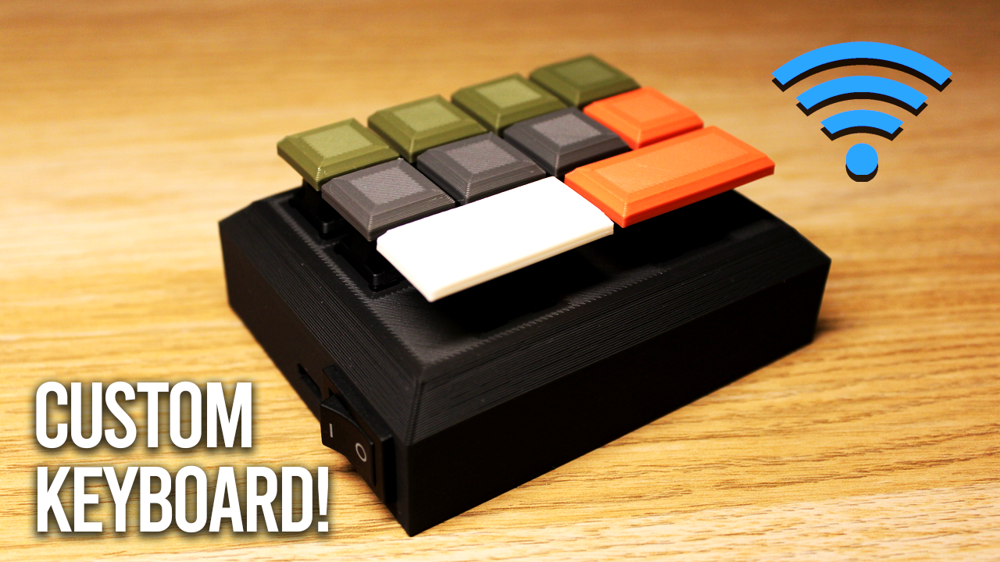
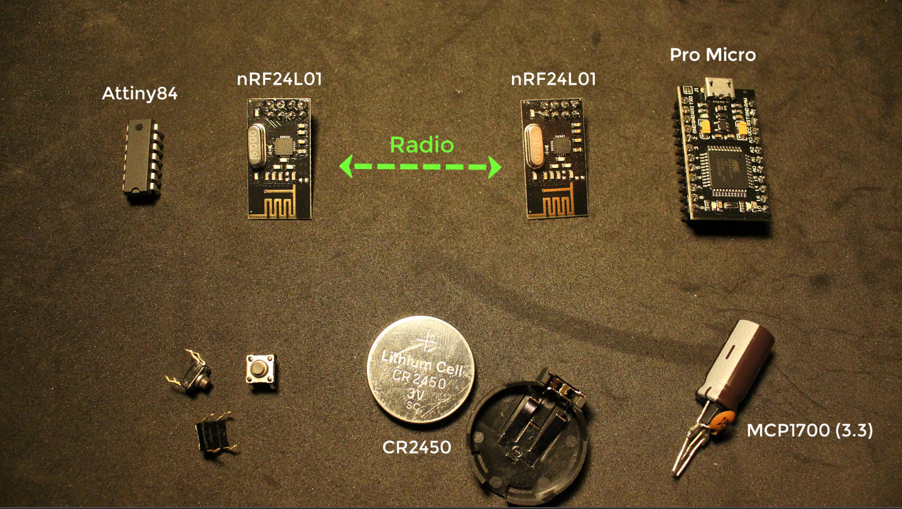
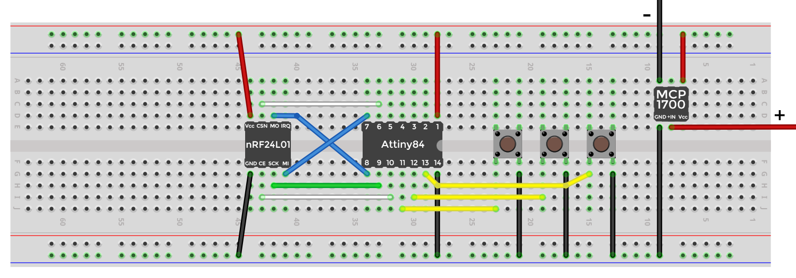
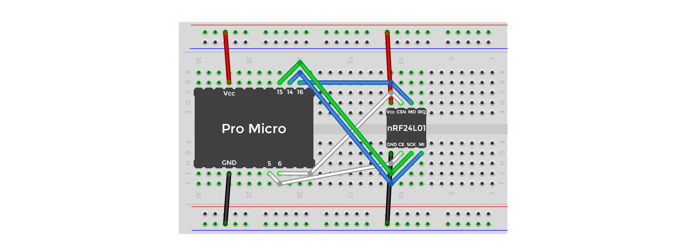
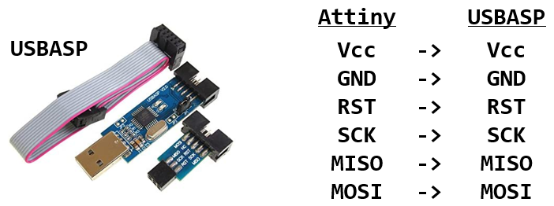
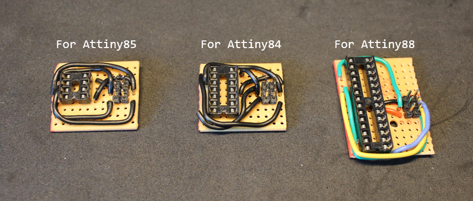

# Arduino custom wireless keyboard

There is a [video](https://youtu.be/N5rOW5Bu1kc) associated with this repo, I highly recommend you watch it if you are going to use this repo.

# How to use

## Libraries needed

- `RF24` by TMRh20, this can be installed directly from the Arduino library manager.

## For the transmitter

- This is the micro-controller (MC) that will be running on battery and where all the buttons will be connected to. This needs to be a low current consuming MC and one that ideally meets the number of inputs pins to match the number buttons you are going to have.
- I highly recommend the Attiny MCs, such as the Attiny85 (8 pins), Attiny84 (14 pins), or the Attiny88 (28 pins).
- Changes you need to make to the code (`/transmitter`):
    - The `CE and CSN` pin numbers to match your connections, these could be any GPIO pins in your MC.
    - `MAX_SHORTCUT_KEYS`, this is the maximum number of characters a keyboard shortcut/sequence can be. This is specified so only the required number of bytes are sent through the radio signal.
    - The `BUTTONS_INFO` array. Each button element is made up of two values, the first is the pin number the button is connected to your MC. The second is a string of characters seperated by spaces. The characters are represented by their decimal/int values, which can be found [here](http://www.asciitable.com/) and [here](https://www.arduino.cc/reference/en/language/functions/usb/keyboard/keyboardmodifiers/). Make sure you don't go over your `MAX_SHORTCUT_KEYS` in the string of keys, if more keys are required, simply increase `MAX_SHORTCUT_KEYS`.

## For the Receiver

- Any MC can be used here with USB cable connection, and one that has HID support so you can easily use the Arduino Keyboard library with no issues. I recommend the Pro Micro MC.
- Changes you need to make to the code (`/receiver`):
    - The only change you need to make is if you changed the `MAX_SHORTCUT_KEYS` in the transmitter side, if you did, make sure the `MAX_SHORTCUT_KEYS` matches.

## For 3D printing

Please refer to the `/3d_models` directory.

# Components

# Wiring

## Transmitter

## Receiver

# How to upload code to Attiny MCs

- The Attiny MCs can be programmed just like any Arduino and it's very easy to upload code to them.
- You just need a USBASP adapter, then simply make the connections as shown in the image below.

- You will also need to install the Attiny boards using the [AttinyCore](https://github.com/SpenceKonde/ATTinyCore) board manager by placing this link `http://drazzy.com/package_drazzy.com_index.json` to your "Additional Boards Manager URLs", which can be accessed in `File > Preferences`.

- From `Tools > Board`, choose your Attiny board with the no bootloader option.
- Then go to `Tools > Programmer` and choose `USBasp (ATTinyCore)`, and then press `Tools > Burn Bootloader`.
- Then to simply upload code, use `Sketch > Upload Using Programmer`.

- You can use stripboards with some wires to make uploading code to the Attiny MCs more convenient:

